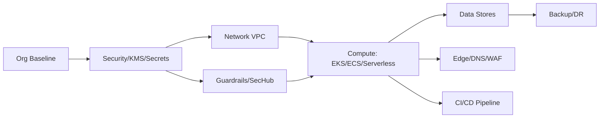

# Architecture Overview

This repo provides modular CloudFormation stacks for Org baseline, Security, Network, Compute (EKS/ECS/Serverless), Data, CI/CD, and Ops.
Use nested stacks or StackSets for scale. Diagrams below show high-level flows.

Repo Tree
Cloudformation/
  aws-cfn-enterprise-templates/
    README.md
    .gitignore
    LICENSE
    deploy.sh
    .yamllint
    .cfnlintrc
    .editorconfig
    .pre-commit-config.yaml
    Makefile
    CONTRIBUTING.md
    CODEOWNERS
    cfn/
      _shared/
        stack-policies/
          stack-policy.json
        parameters/
          dev.json
          prod.json
        nested/
          enterprise-baseline.yaml
      00-org-baseline/
        template.yaml
      01-security-kms-secrets/
        template.yaml
      02-logging-observability/
        template.yaml
      10-network-vpc-baseline/
        template.yaml
      11-edge-dns-waf/
        template.yaml
      20-eks-cluster/
        template.yaml
      21-eks-addons-irsa/
        template.yaml
      30-rds-aurora/
        template.yaml
      31-dynamodb-elasticache/
        template.yaml
      40-serverless-api/
        template.yaml
      50-cicd-pipeline/
        template.yaml
      51-image-build-ecr/
        template.yaml
      60-guardrails-sec-hub/
        template.yaml
      61-backup-and-dr/
        template.yaml
      70-cost-tagging/
        template.yaml
      80-appconfig-featureflags/
        template.yaml
      90-sample-workload-alb-asg/
        template.yaml
    .github/
      workflows/
        cfn-validate.yml
    guard/
      s3.guard
      logs.guard
    scripts/
      create-change-set.sh
      detect-drift.sh
      validate-all.sh
      deploy-all.sh
    docs/
      ARCHITECTURE.md
    examples/
      README.md
